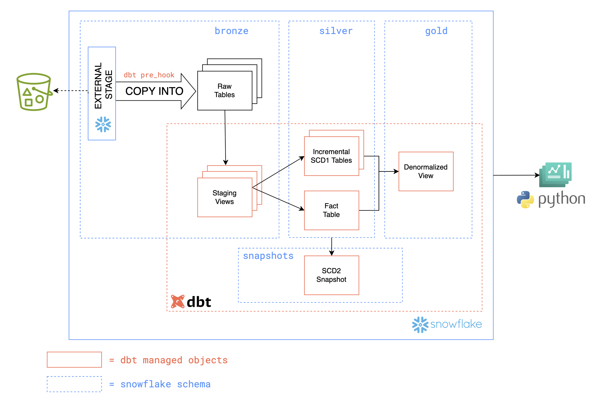
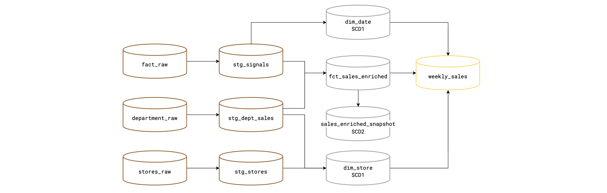
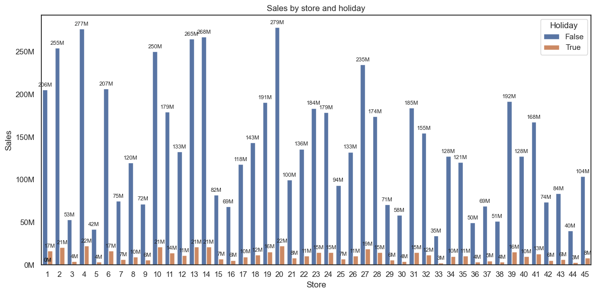
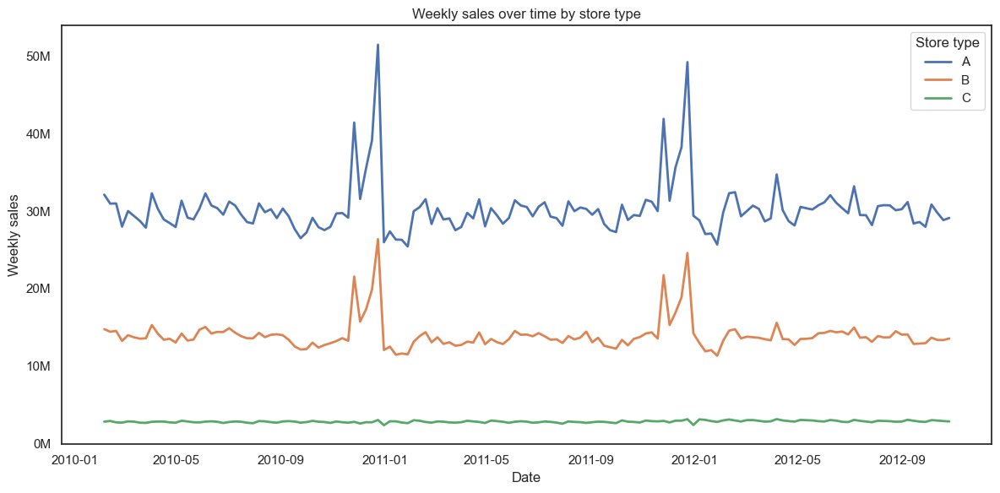
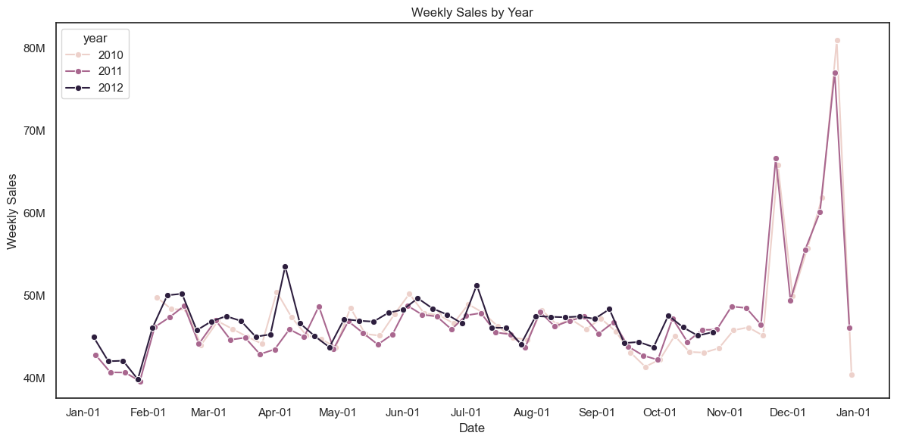
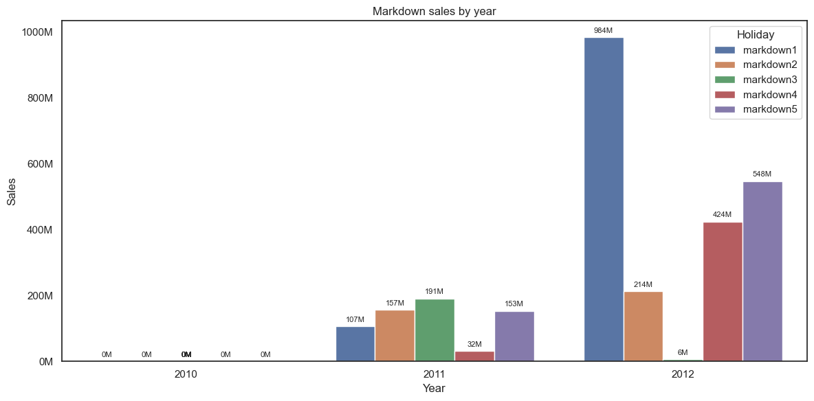

# Walmart Retail Analytics Pipeline

## Business goal
Build clean, analytics-ready datasets to study weekly store department sales and how they relate to store attributes and external drivers (fuel price, temperature, unemployment, CPI, markdowns, holidays).

Data sources:
- Stores attributes for each store
- Weekly sales by store-department
- Weekly external factors & markdown sales by store

Outputs: 
- Final tables created in Snowflake using DBT include:
  - `walmart_store_dim` (SCD1, row per store-department)
  - `walmart_date_dim` (SCD1, row per week)
  - `walmart_fact_table` (SCD2, row per store-department-week)
- Visualizations for BI reporting using Python libraries & snowflake connector

## Architecture
This pipeline ingests Walmart retail datasets from S3, builds fact and dimensions tables in Snowflake using dbt, captures historical changes, and produces visualizations for BI reporting in Python.



S3 bucket contains CSV data for each dataset:
- `stores/stores.csv` - store attributes
- `department/department.csv` - store department weekly sales
- `fact/fact.csv` - external factors by store and week

Target database is stored in Snowflake with the following schemas:
- Bronze schema: external stage for S3, raw source tables
- Silver schema: clean tables built by DBT
- Gold schema: denormalized analytics view built by DBT

DBT loads source data from S3, builds fact and dimensions tables in Snowflake, and captures historical changes.

- Loads raw source tables from S3
  - `load_csv` macro runs `COPY INTO` command using args for each table: `stores_raw`, `department_raw`, `fact_raw`
  - Configured as pre-hook for each staging model in bronze layer
- Builds staging views 1:1 with sources
  - `stg_stores_raw` (grain: store)
  - `stg_department_raw` (grain: store-department-week)
  - `stg_fact_raw` (grain: store-week)
- Builds incremental models implementing SCD1 for
  - `walmart_store_dim` (grain: store-department)
  - `walmart_date_dim` (grain: week)
- Builds SCD2 model for walmart_fact_table in two steps
  - `walmart_fact_table` (grain: store-department-week)
  - `walmart_fact_snapshot` (snapshot captures historical changes on table above)
- Python code used to produce visualizations for BI reporting with Python libraries
  - Python-snowflake connector is used to query final tables in Snowflake
  - Matplotlib & seaborn used to create visualizations


## DBT Lineage Graph




## Data Quality

Tests planned to add
- Not null and unique tests for all PKs


## Setup
Run snowflake/walmart.sql to create database and define source tables in Snowflake SQL file.

## DBT Job
Run DBT commands to build pipeline.
```
dbt build --select "models/walmart/bronze"
dbt build --select "models/walmart/silver"
dbt snapshot
dbt build --select "models/walmart/gold"
```

## Visualizations
Visualizations for BI reporting produced in Python [`walmart_analysis`](../visualizations/walmart_analysis.ipynb).







## Project files
```text
├── snowflake
│   └── walmart
│       └── walmart.sql
│
├── visualizations
│       └── walmart_analysis.ipynb
│
└── dbt
    ├── macros
    │   └── load_csv.sql
    │
    ├── models
    │   └── walmart
    │       ├── bronze
    │       │   ├── _bronze.yml
    │       │   ├── stg_stores_raw.sql
    │       │   ├── stg_department_raw.sql
    │       │   └── stg_fact_raw.sql
    │       ├── silver
    │       │   ├── walmart_store_dim.sql
    │       │   ├── walmart_date_dim.sql
    │       │   └── walmart_fact_table.sql
    │       └── gold
    │           └── weekly_sales.sql
    │
    ├── snapshots
    │   └── walmart_fact_snapshot.sql
    │
    ├── packages.yml        # shared
    └── dbt_project.yml     # shared (multi-project)
```